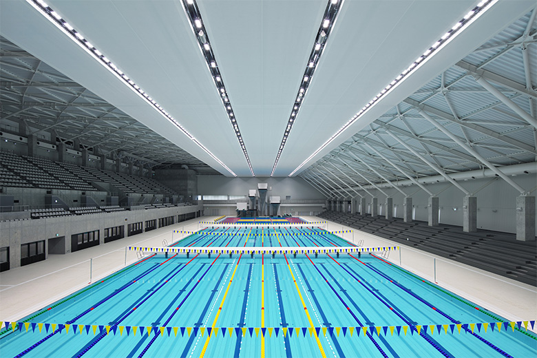

<!DOCTYPE html>
<html lang="ja">
<head>
  <meta charset="UTF-8">
  <title>水夢杯ホームページ</title>
  <link href="https://cdnjs.cloudflare.com/ajax/libs/lightbox2/2.7.1/css/lightbox.css" rel="stylesheet" />
  
</head>
<body>
  <header>
    <h1 class="grey">!!! 2026/02/** 第二回 水夢杯開催 !!!</h1>
  </header>

  <main>
    <h2 class="yellow">第二回 水夢杯 募集要項</h2>
    <h2>
      <a href="2次要項.pdf" target="_blank">募集要項</a> 
      <a href="2025年_第1回水夢杯ランキング.pdf" target="_blank">第一回大会ランキング</a>
    </h2>

    <section>
      
以下にPDF,Excel形式の申し込み用紙を用意してあります。

      

        <a href="仮申し込み用紙.pdf" target="_blank">【PDF】申込用紙</a>
        <a href="仮申し込み用紙.xlsx" target="_blank">【Excel】申込用紙</a>
      

      <h2><a href="mailto:smilekawachi@gmail.com">メール送信</a></h2>
    </section>

    
  </main>

  <footer>
    
Copyright 2025/04/20 R. Yamashita

  </footer>

  
  
</body>
</html>
